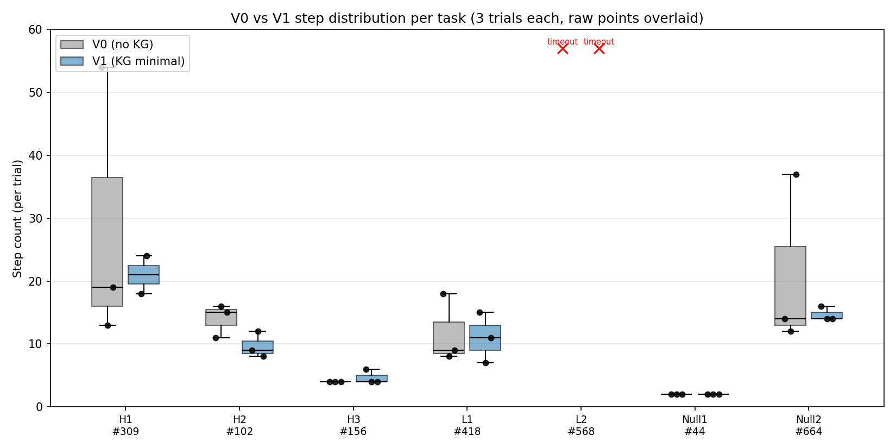

# 사이트별 구조 지식 그래프는 웹 에이전트에 언제 도움이 되는가

## When Does a Site-Specific Structural Knowledge Graph Help an LLM Web Agent?

---

## 요 약

LLM 기반 웹 에이전트가 같은 사이트의 페이지 구조를 매번 관측에서 재발견하는 비효율을 해소하기 위해, 사이트 구조를 사전 계산된 지식 그래프(Knowledge Graph, KG)로 외부화하고 최소 힌트로 주입한 KG 기반 에이전트를 KG 미사용 baseline과 WebArena-Verified GitLab 7개 태스크 × 3회 측정으로 비교했다. 측정 도중 평가기의 메타데이터·답 포맷·API 엔드포인트 불일치(mismatch) 결함이 다수 식별되어 평가기 통과율을 KG 효과 지표로 그대로 쓸 수 없었기에, 에이전트가 태스크의 의미적 목표에 도달·완수했는지를 로그·HAR로 검증한 시행 비율을 의미적 성공률로 재정의해 비교했다. 의미적 성공률은 baseline과 KG 기반 에이전트가 6/7 성공으로 동일하여 KG는 태스크 통과 여부를 바꾸지 않는 것으로 나타났으며, 통과 여부는 baseline LLM 에이전트의 일반 추론 능력에 좌우된다. step 효율 측면에서 KG 기반 에이전트는 의미적으로 성공한 6개 태스크 중 4개 태스크에서 평균 0.7~7.7 step을 단축했고, 특히 2개 태스크(309, 664)에서는 baseline의 outlier trial(54·37 step)을 일관된 범위로 안정화해 표준편차를 5~12배 줄였다. 즉 KG는 worst-case 표준편차 감소를 통해 step 효율을 개선한다. 비-ARIA 모달 단일 태스크(568)에서는 양쪽 모두 timeout이 발생하여, KG의 ARIA 표준 기반 수집기가 비표준 컴포넌트를 포착하지 못함이 적용 한계로 드러났다. 결과적으로 KG는 step 효율 도구로서 유의미한 효과를 보이지만 의미적 성공률 자체에는 영향을 주지 않는다.

---

## 1. 서 론

LLM 기반 웹 에이전트[1, 2]는 같은 사이트의 태스크들을 처리할 때 어떤 페이지에 가야 하는지, 그 페이지에 어떤 필터·버튼이 있는지, 어떤 URL 경로가 효율적인지를 매번 관측을 통해 다시 찾아내야 한다. 동일한 사이트 구조를 여러 태스크에 걸쳐 반복 탐색하는 비효율이 누적된다.

선행 연구는 같은 사이트에서 반복되는 탐색을 줄이기 위해 사이트별 지식을 미리 만들어 두는 방식으로 접근해 왔다. SteP[3]은 사람이 직접 작성한 정책 스택(manual policy stack)을, WALT[4]는 사이트의 UI를 분석해 추출한 도구 함수(reverse-engineered tool function)를, AWM[5]은 과거 실행 기록(execution trajectory)의 재사용을 활용한다. 이들이 모두 에이전트의 행동 패턴을 자산화하는 반면, 본 연구는 사이트 구조 자체를 그래프로 외부화하고 최소 힌트로 에이전트에 주입한다.

이를 분석하기 위해 본 연구는 웹 접근성 표준 ARIA의 역할 속성(role=button·menuitem·dialog 등)과 HTML 표준 폼 요소(input·select·textarea·button 등)만으로 사이트와 무관하게 사이트 구조를 추출하는 KG 구축 프로토콜과, 추출된 구조에서 페이지 클래스·URL 경로·필터 카테고리 같은 구조 정보만 노출하고 라벨 값·URL 파라미터 값·텍스트 콘텐츠 같은 구체값은 에이전트의 페이지 상호작용에 위임하는 최소 힌트 방식을 제시한다. 효과 후보(H)·한계 후보(L)·무영향 후보(Null) 세 분류의 태스크 매트릭스 적용 범위를 기준으로 7개의 태스크를 선정해 관찰했다. 본 선정은 가능한 모든 KG 효과 조건을 망라하지 않으므로 결과는 관찰된 조건에 한정된다. 측정 도중 WebArena-Verified 평가기의 메타데이터·엄격 일치(strict-match)·엔드포인트 불일치 결함이 KG 효과를 가리는 잡음으로 작용함을 발견하여, 평가기 출력 대신 의미적 성공률(에이전트가 태스크의 의미적 목표에 도달·완수했음을 로그·HAR로 검증한 시행 비율)을 별도 지표로 도입해 통과율과 step 효율을 분리 분석했다. 그 결과로 (a) 의미적 성공률은 baseline과 KG 기반 에이전트가 6/7로 동일 — 태스크 통과 여부는 baseline LLM 에이전트 능력에 좌우됨, (b) step 효율은 KG 기반 에이전트가 4 태스크에서 평균 0.7~7.7 단축 + 2 태스크에서 worst-case 표준편차 5~12배 감소, (c) 비-ARIA 모달이 KG 적용 한계라는 세 관찰을 보고한다.

## 2. 방 법

### 2.1 KG 구축

세 단계로 수행한다. 1단계는 출발 URL 집합에서 너비 우선 탐색으로 페이지를 수집하고 URL 패턴(path 구조)으로 페이지 클래스를 할당한다. 2단계는 각 클래스에 속하는 페이지에서 ARIA 역할 속성(role=menuitem·option·tab·dialog 등으로 명시된 메뉴 항목·옵션·탭·대화상자 팝업 트리거)과 HTML 표준 폼 요소(input·select·textarea·button 등)만을 근거로 액션·필터·대화상자를 수집한다. 의도적으로 사이트와 무관하게 설계되어 비표준 컴포넌트는 포착하지 않는 대신 단일 구현으로 여러 사이트에 이식된다. 3단계는 URL 템플릿, 범위, 트리거 문구, 필터 카테고리를 결합해 페이지 클래스 목록을 만든다. 본 연구에서 대표적으로 구축한 GitLab KG는 139개의 클래스·23개 클래스의 필터 카테고리·2,731개의 페이지 간 이동 관계를 담는다.

### 2.2 에이전트의 KG 활용과 노출 범위

실행 시점에서 KG는 세 모듈로 소비된다. 목표 페이지 클래스 추론기는 같은 태스크에 대해 LLM을 3번 호출한 뒤 가장 많이 일치한 답을 선택하는 자기 일관성(self-consistency) 방식으로, 에이전트가 도달해야 할 목표 페이지 클래스를 결정한다. 경로 탐색기는 현재 페이지 클래스에서 목표 페이지 클래스까지의 경로를 탐색하되, 정확한 경로가 없으면 인접 클래스, 사이트 상위 진입점, 사이트 메인 페이지 순으로 차선 경로를 단계적으로 시도한다. 힌트 생성기는 경로 단축 URL과 현재 페이지 표면 정보(액션 목록·필터 카테고리 존재)를 관측 메시지에 주입한다.

에이전트가 KG의 구체값을 검증 없이 그대로 따라 잘못된 경로로 빠질 위험을 줄이기 위해, 본 연구의 KG는 사이트의 구조 정보(어떤 페이지·경로·필터 카테고리가 존재하는지)까지만 힌트로 노출하고, 그 안에 들어갈 구체값(필터 라벨·URL 파라미터 값·텍스트 콘텐츠)은 에이전트가 페이지를 직접 보고 찾도록 한다.

### 2.3 측정

WebArena-Verified GitLab 자가 호스팅 인스턴스를 사용한다. 에이전트 LLM은 OpenAI gpt-5.4-mini 단일 모델이다. baseline(KG 미사용)과 KG 기반 에이전트(KG 사용) 각각에 대해 효과 후보(H)·한계 후보(L)·무영향 후보(Null) 세 분류를 모두 포함하는 7개 태스크를 3회씩 반복 측정했다.

## 3. 결 과

### 3.1 태스크 개요와 의미적 성공률 도입

표 1은 7개 태스크의 의도(intent)와 type, KG 추론 클래스를 요약한다(각 태스크의 자세한 의도는 §3.4의 인사이트에서 함께 풀어 쓴다). NAV 3건 / RET 1건 / MUT 3건로 태스크 type이 분산되며 각 태스크는 측정 전에 후보 라벨(효과 후보(H) / 한계 후보(L) / 무영향 후보(Null))이 가설 카드(task_cards)에 등록되어 있다.

| ID  | type | 의도                       | KG 클래스                    |
| --- | ---- | -------------------------- | ---------------------------- |
| 102 | NAV  | help wanted 라벨 이슈 목록 | project/issue_list           |
| 156 | NAV  | 내 assignee MR 목록        | dashboard/merge_request_list |
| 309 | RET  | 최다 commit 사용자명       | project/main                 |
| 418 | MUT  | status "Busy" 설정         | account/edit                 |
| 568 | MUT  | collaborator 초대          | project/member_list          |
| 44  | NAV  | To-Do List 열기            | dashboard/todo_list          |
| 664 | MUT  | issue 생성                 | project/issue_detail         |

WebArena-Verified 평가기 출력만으로 두 에이전트를 비교하면 KG 효과 측정이 평가기 결함의 잡음에 가려진다. 본 측정에서 식별한 결함 유형은 셋이다. (a) 메타데이터 불일치 (태스크 102): 평가기의 기대 URL이 태스크 의도와 다른 저장소(byteblaze/a11y-syntax-highlighting)를 가리키므로 에이전트가 태스크 명시 저장소(a11yproject/a11yproject.com)에 정확히 도달했음에도 fail로 기록. (b) 답 포맷 불일치 (태스크 309): 태스크는 username을 묻지만 평가기 기대 값은 email(wright.grayson@gmail.com)이라 username 답이 엄격 일치에서 실패. (c) API 엔드포인트 불일치 (태스크 664): UI 폼 제출로 이슈 #2393이 실제 생성되었음에도 평가기는 REST /api/v4/projects/{id}/issues POST만 인정해 실패로 기록.

이 세 결함이 두 에이전트 모두에 동일하게 작동하므로 KG 효과 비교 자체는 깨지지 않으나, 평가기 통과율을 보조 지표로 쓰면 KG 효과가 가려진다. 따라서 본 절 이하에서는 의미적 성공률(agent_response.json status=SUCCESS + 로그·HAR 검증으로 태스크가 명시한 의미적 목표에 도달·완수했음이 확인된 시행 비율)을 별도 지표로 채택한다.

### 3.2 의미적 성공률 — baseline과 KG 기반 에이전트가 동일

표 2는 의미적 성공 시행 카운트다. 태스크 단위(task-level, 태스크 내 1 시행이라도 성공)에서 baseline = KG = 6/7로 동일하다. 시행 단위(trial-level, 전체 21 시행)에서는 baseline 18/21·KG 17/21로 KG 기반 에이전트가 1 시행 낮은데, 이는 태스크 309 KG 기반 에이전트의 시행 1에서 KG가 잘못된 클래스를 단정적으로 안내해 에이전트가 그 경로에 갇혀 모든 재시도를 소진한 사례를 정직하게 노출한다.

| ID  | baseline    | KG          | 비고                                            |
| --- | ----------- | ----------- | ----------------------------------------------- |
| 102 | 3/3         | 3/3         | 라벨 필터 적용된 issue 페이지 도달              |
| 156 | 3/3         | 3/3         | dashboard MR assigned 도달                      |
| 309 | 3/3         | 2/3         | KG 시행 1: 잘못된 고정 목표 신뢰 후 재시도 소진 |
| 418 | 3/3         | 3/3         | status "Busy" 설정 완료                         |
| 568 | 0/3         | 0/3         | 모달 한계 — §3.5에서 별도 분석                  |
| 44  | 3/3         | 3/3         | /dashboard/todos 도달                           |
| 664 | 3/3         | 3/3         | issue #2393 실제 생성                           |
| 계  | 18/21 (86%) | 17/21 (81%) | 태스크 단위 6/7 동일                            |

### 3.3 Step 효율 — KG 기반 에이전트가 4 태스크에서 평균 단축

그림 1은 태스크별 baseline/KG step 분포(3 시행 각각, box plot + scatter)를 시각화한다. H1(309)·Null2(664)에서 baseline box가 위로 길게 늘어진 것은 baseline의 outlier trial이 worst-case를 끌어올린 결과이며, 같은 태스크의 KG box가 좁게 붙어 있는 것이 worst-case 표준편차 감소의 시각적 표지다. 568은 양쪽 모두 timeout으로 ×표기.

표 3은 의미적으로 성공한 6 태스크의 step 통계로, 평균 옆 괄호 안의 값은 표준편차(sd), 대괄호 안은 raw 3 시행 값이다.

| ID  | baseline 시행 | baseline 평균 (sd) | KG 시행    | KG 평균 (sd) | Δ평균 | sd 변화 |
| --- | ------------- | ------------------ | ---------- | ------------ | ----- | ------- |
| 102 | [11,15,16]    | 14.0 (2.7)         | [8,9,12]   | 9.7 (2.1)    | −4.3  | 2.7→2.1 |
| 156 | [4,4,4]       | 4.0 (0.0)          | [4,4,6]    | 4.7 (1.2)    | +0.7  | 0→1.2   |
| 309 | [13,19,54]    | 28.7 (22.1)        | [18,24]ᵃ   | 21.0 (4.2)   | −7.7  | 5×↓     |
| 418 | [8,9,18]      | 11.7 (5.5)         | [7,11,15]  | 11.0 (4.0)   | −0.7  | 5.5→4.0 |
| 44  | [2,2,2]       | 2.0 (0.0)          | [2,2,2]    | 2.0 (0.0)    | 0.0   | 동일    |
| 664 | [12,14,37]    | 21.0 (13.9)        | [14,14,16] | 14.7 (1.2)   | −6.3  | 12×↓    |

ᵃ 309 KG 기반 에이전트는 시행 1 ERROR 제외 2 시행 집계.

KG 기반 에이전트가 평균 단축한 태스크는 4건(102, 309, 418, 664), 동등(parity) 1건(44), KG가 약간 손해 1건(156)이다. 그 중 309·664는 sd 감소(5~12배)가 두드러져 worst-case 표준편차 감소가 평균 단축의 주요 동인이다.

### 3.4 인사이트 — KG 효과의 발생 조건과 메커니즘 (568 제외 6 태스크)

각 태스크의 효과 메커니즘을 분리해 정리한다.

102 — 안정적 평균 단축 (다중 hop NAV). KG는 project/issue_list 추론과 /-/issues 경로 단축을 활용해 baseline의 3-hop(프로젝트→Issues→라벨)을 1-hop goto로 압축한다. KG는 라벨 카테고리 존재만 알려주고 라벨 값 "help wanted"는 에이전트가 태스크에서 추출 → 드롭다운 직접 클릭. 양쪽 sd가 작아 효과가 시행 간 안정.

309 — baseline의 검색 폭주를 KG가 차단 (단일 URL RET). baseline 시행 [13, 19, 54] sd 22.1 — 54-step 시행은 commit 페이지·검색 박스·필터 사이를 반복 왕복하는 패턴이다. KG는 project/main으로 합의 추론해 프로젝트 메인을 고정 목표로 제시 → 에이전트가 안내된 경로를 유지하며 commit 페이지를 빠르게 식별한다. KG의 직접 효과는 commit 페이지 자체가 아니라 프로젝트 고정 목표 제공으로 baseline의 검색 회로를 차단하는 것이다. 단 KG 시행 1은 잘못된 고정 목표에 갇혀 재시도 소진된 반대 사례도 함께 발생.

664 — baseline의 폼 혼란을 KG가 차단 (issue 작성 MUT). baseline [12, 14, 37] sd 13.9 — 37-step 시행은 폼 작성 중 다른 프로젝트로의 잘못된 이동·복귀를 반복한다. KG의 project/issue_detail 의미적 인접 클래스 안내로 new issue 사이드바 항목에 즉시 도달 → 폼을 한 번에 작성. 309와 동일하게 "고정 목표가 baseline의 outlier 분기를 차단" 메커니즘이지만 분기 패턴은 다르다 — 309는 검색 회로, 664는 폼 작성 중 분기.

418 — 작은 양쪽 개선 (status 설정 MUT). KG는 account/edit으로 단정적 추론하지만 status UI는 navbar avatar 팝오버에 위치해 정확 매핑은 아니다. 그럼에도 의미적으로 인접한 클래스로 작용해 평균 −0.7 단축, worst-case 18→15. 사전 가설이었던 active misdirection(KG의 잘못된 안내로 timeout 유발)은 발생하지 않았다.

156 — 효과 미발생 (범위 모호 NAV). baseline 평균 4.0 (sd 0) → KG 평균 4.7 (sd 1.2). baseline이 이미 1-2 hop 효율적이라 KG의 단축 여지가 없으며 KG 시행 1건은 6 step으로 확장되어 역효과 경계 사례를 보인다.

44 — 무영향 (1-step 직접 링크 NAV). baseline = KG = 2 step (sd 0). KG가 줄 추가 구조 정보가 없는 active control. 측정 도구가 "차이 없음"을 출력할 능력을 가짐을 입증한다.

종합하면, KG는 (i) baseline이 outlier 분기 가능성이 있는 다중 단계 경로를 거치고 (ii) 목표 페이지 클래스 또는 의미적으로 인접한 클래스가 KG에 매핑되어 있을 때 평균 단축과 worst-case 표준편차 감소로 step 효율을 개선한다. baseline이 이미 효율적인 경우 KG는 무영향이거나 작은 역효과를 줄 수 있으며, 모든 효과는 step 단위에 한정되어 의미적 성공 여부 자체는 변화시키지 않는다 — 태스크 통과 능력은 baseline LLM 에이전트의 일반 추론 능력에 의해 결정된다.

### 3.5 태스크 568 — 비-ARIA 모달의 KG 적용 한계 (별도 분석)

다른 6 태스크와 달리 568은 양쪽 모두 의미적으로 실패한다. "Invite members" 다이얼로그가 GitLab Pajamas Vue 컴포넌트로 ARIA-non-conformant이며 KG의 project/member_list 클래스에 모달 내부 액션 목록이 비어 있다. 두 에이전트 모두 모달 트리거(Invite members 버튼)까지는 도달하지만 모달 내부의 사용자 검색 입력·역할 선택을 처리하지 못해 3 시행 모두 20분 timeout 발생한다. KG 기여는 모달 진입 직전까지로 한정되며 내부에서 소멸한다. 이 한계는 KG가 ARIA 표준 기반 수집기로 빌드되어 있다는 의도적 설계 선택에서 기인하며, 비표준 컴포넌트가 다수인 최신 웹 프레임워크에서는 KG 적용 한계가 된다. 568은 다른 6 태스크와는 전혀 다른 패턴(둘 다 실패, KG 도움 범위 밖)이므로 §3.4의 효과 조건 분석에서 분리해 별도 절로 보고한다.

## 4. 결론 및 향후 연구

본 연구는 OpenAI gpt-5.4-mini 단일 모델 위에서 WebArena-Verified GitLab의 7 태스크를 baseline과 KG 기반 에이전트로 측정해 사이트별 KG의 효과를 정직하게 특성화했다. 핵심 발견은 다음 셋이다.

(1) Step 효율에서 유의미한 효과. KG 기반 에이전트는 의미적으로 성공한 6 태스크 중 4 태스크(102, 309, 418, 664)에서 평균 step을 0.7~7.7 단축한다. 특히 2 태스크(309, 664)에서는 baseline의 outlier trial(54·37 step)을 일관된 범위로 안정화하여 표준편차를 5~12배 줄였으며, 이러한 worst-case 표준편차 감소가 주요 메커니즘이다. KG가 제시한 고정 목표가 baseline의 outlier 분기(검색 회로·폼 혼란)를 차단한다.

(2) 태스크 성공률은 baseline 능력에 좌우. 의미적 성공률은 baseline = KG = 6/7(태스크 단위)로 동일하다. 시행 단위에서는 baseline 18/21·KG 17/21로 KG가 한 시행 낮다(309의 잘못된 고정 목표 갇힘 사례). KG는 태스크가 통과되는지 여부가 아니라 통과까지의 효율에 기여하며, 의미적 성공·실패는 LLM 에이전트의 일반 추론 능력에 의해 결정된다.

(3) 비-ARIA 컴포넌트가 적용 한계. 568에서 KG는 모달 트리거 도달 직전까지만 안내하고 내부에서 기여가 소멸한다. ARIA 표준 기반 수집기의 의도적 한계이며 최신 웹 프레임워크에서 KG 적용 범위를 제약한다.

향후 연구 방향은 (i) KG 재설계 — 비-ARIA 컴포넌트를 직접 탐색하는 수집기 확장으로 모달·Vue 기반 widget 내부도 매핑하여 적용 범위를 넓히는 것, (ii) 다른 사이트에서의 일반화 — Reddit/Postmill 등 ARIA 준수도(conformance) 수준이 다른 사이트에서 동일 KG 구축 프로토콜이 사이트와 무관하게 작동하는지 cross-site 측정으로 실증하는 것, (iii) 성공률 측면 기여 가능성 — KG가 step 효율을 넘어 답 포맷·HTTP 요청 패턴까지 가이드하면 의미적 성공률 자체에도 기여할 수 있는지 — 본 연구가 step 효율 효과는 실증했지만 통과율 기여는 시도되지 않은 차원으로 남았다 — 를 조사하는 것이다.

한계. 본 7 태스크 선정이 태스크 분류 매트릭스 적용 범위를 위한 일련의 기준에 따른 것이며 가능한 모든 KG 효과 조건을 망라하지 않으므로 결과는 관찰된 조건에 한정된다. 단일 사이트(GitLab)·단일 모델·round 단위 반복 측정 방식으로 일반화는 제한적이며, 평가기 메타데이터·엄격 일치 결함이 KG 효과 측정의 외부 잡음으로 작용한다.

## 참 고 문 헌

[1] S. Zhou et al., "WebArena: A Realistic Web Environment for Building Autonomous Agents," ICLR, 2024.

[2] WebArena-Verified Contributors, "WebArena-Verified: a Peer-Reviewed Benchmark for LLM Web Agent Evaluation," 2025.

[3] P. Sodhi et al., "SteP: Stacked LLM Policies for Web Actions," COLM, 2024.

[4] J. Y. Koh et al., "WALT: Web Agents that Learn Tools," arXiv:2510.01524, 2025.

[5] Z. Wang et al., "Agent Workflow Memory," ACL, 2024.
