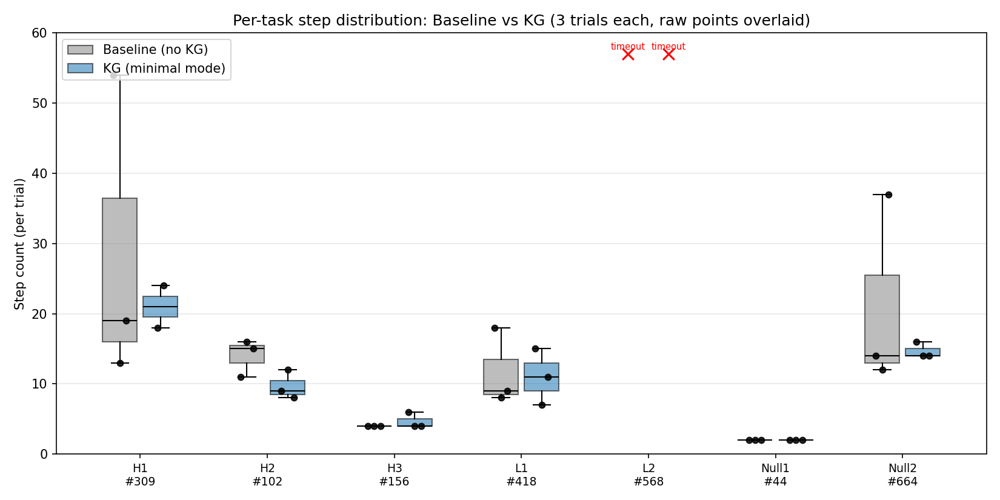
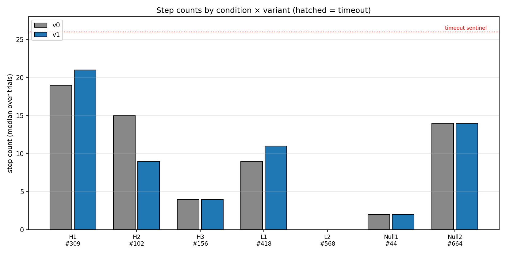

# 측정 1 — characterization

KG advisory hint가 에이전트 step에 미치는 영향을 WebArena-Verified GitLab에서
ablation으로 측정한 1차 라운드. 본 문서는 측정 1의 정의·결과·재현 경로를
tracked 스냅샷으로 동결한다. 후속 라운드는 `measurement_2.md` 등으로 확장한다.

## 설계

| 항목 | 값 |
|---|---|
| 사이트 | WebArena-Verified GitLab |
| 조건 | 7 condition — 가설 H1–H3 / 저신뢰 L1–L2 / 대조군 Null1–Null2 |
| 변종 | v0 = baseline (KG off), v1 = KG (advisory hint) |
| 반복 | condition × variant × 3 trial |
| 모델 | gpt-5.4-mini |
| 측정일 | 2026-04-28 (git `a34a3ac`) |

condition·task 정의: [`docs/evaluation/`](../evaluation/). 변종 정의: [`docs/evaluation/variants.md`](../evaluation/variants.md).

## 결과

자동 triage 판정 (cell별 수동 narrative 미완):

| Cond | Task | V0 step | V1 step | 판정 |
|------|-----:|--------:|--------:|------|
| H1 | 309 | 19 | 21 | refuted |
| H2 | 102 | 15 | 9 | confirmed |
| H3 | 156 | 4 | 4 | partial |
| L1 | 418 | 9 | 11 | needs_review |
| L2 | 568 | timeout | timeout | parity_review |
| Null1 | 44 | 2 | 2 | confirmed_parity |
| Null2 | 664 | 14 | 14 | confirmed_parity |

상세 수치: [`docs/assets/results_condition_synthesis.md`](../assets/results_condition_synthesis.md).

### 정직한 해석

- median step 효과는 **혼재** — KG가 줄인 경우(H2)도 늘린 경우(H1)도 있다.
  "KG가 일관되게 step을 줄인다"는 결론은 나오지 않았다.
- step **분포**(box)에서 KG가 baseline 큰 분산을 좁히는 경향이 보이나
  (H1·Null2), 역행 cell(L1)도 있어 일관 효과로 주장하지 않는다.
- 대조군(Null1·Null2)이 모두 parity → 실험 설계가 의도대로 작동함을 뒷받침.
- 표본이 작아(3 trial) 효과 *방향* 탐색 수준이며 확정적 효과 크기 주장 아님.

## 재현

원천 동결 번들은 `output/measurements/m1_characterization/` (gitignore — 원천
용량 과대로 비추적). 번들 내 `MANIFEST.md`에 측정 정보·스크립트 상태·재현
명령(figure 재렌더 / raw 재실행) 기록.

tracked figure 자산은 `docs/assets/` (`step_box.png`, `step_counts.png`,
`results_condition_synthesis.md`)에 보존된다.
